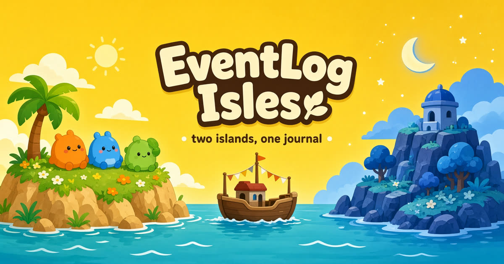

# EventLog Isles

[Play it](https://effect-event-log.grok.me) · 中 / EN

Two islands, one journal. A playable demo of [Effect](https://effect.website) **EventLog**.

写进账本，岛上就长出来。太阳岛和月亮岛，各自一本只能往后写的账。

## What it teaches

You raise critters (Pip, Nub, Bean) by writing events. Six short missions walk the EventLog loop:

1. **Hatch** — a write becomes a critter on the isle and a line in the journal
2. **Stuffed** — the handler says no, so that feed never happened
3. **Storm / replay** — the projection is wiped; the journal still remembers
4. **Ferry** — the same `primaryKey` syncs to Moon Isle as events, not a copied world
5. **Two names** — both sides append different events for the same key
6. **Compact** — a long journal folds into a snapshot; replay still matches

The write path the isles act out:

`client` → `EventGroup` → **handler first** → `EventJournal` appends only if the handler said yes.

This app is **not** written in Effect. The isles are a beginner tutorial so append-only journals, handler-first writes, and projection/replay can be felt in play.

## Play

Open [effect-event-log.grok.me](https://effect-event-log.grok.me). Language follows the browser (`zh` / `en`) and can be toggled.

Made by [Ray](https://x.com/xesrevinu) with Grok.
